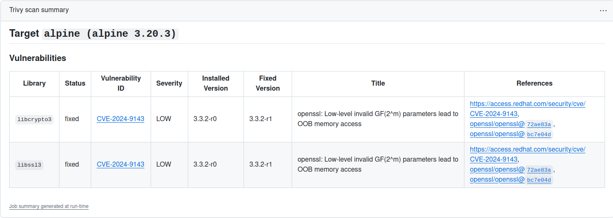

# md



## Installation

```sh
$ trivy plugin install github.com/dramf/md
```

## Usage
### Using CLI
Formatted report will be saved to the file `trivy-report.md`
```sh
$ trivy image alpine --output plugin=md --format json
```
### Using GitHub Actions
```sh
jobs:
  scan:
    name: Trivy-scan
    runs-on: ubuntu-22.04
    steps:

      - name: Install plugin
        run: |
          trivy plugin install github.com/dramf/md

      - name: Run Trivy vulnerability scanner in repo mode
        uses: aquasecurity/trivy-action@master
        with:
          format: 'json'
          output: 'plugin=md'

      - name: Get Summary
        run: cat trivy-report.md >> $GITHUB_STEP_SUMMARY
```